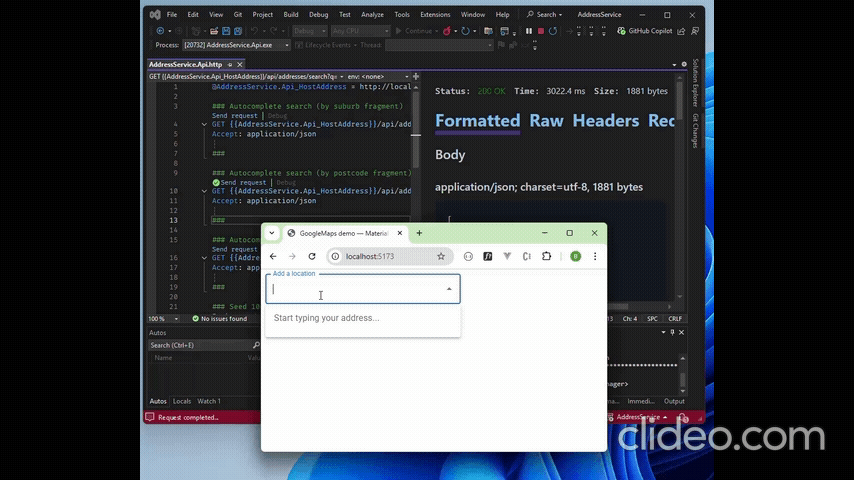

Here is your updated README section **including `screenshot.gif`** exactly as requested:

---

# React MUI Autocomplete Demo



This demo is **based on the official MUI Autocomplete example** (Google Maps Places), but refactored to work with a **custom Address Search API** instead of Google.

- API repo: [https://github.com/bimendra/AddressService](https://github.com/bimendra/AddressService)
- Live demo (StackBlitz): [https://stackblitz.com/run?file=src%2FDemo.tsx](https://stackblitz.com/run?file=src%2FDemo.tsx)

> Original MUI docs section: **“Google Maps place”** — A customized UI for Google Maps Places Autocomplete.
> We replaced the Google client library and prediction mapping with calls to our API:
> `GET /api/addresses/search?q=<fragment>&pageSize=<n>`.

---

## What’s in this demo

- MUI `<Autocomplete />` wired to our API
- Debounced requests with `AbortController` to cancel stale queries
- Highlighted matches using `autosuggest-highlight`
- Loading spinner in the input’s end adornment
- Minimal error handling and no client-side filtering (server-driven results)

---

## Quick start (local)

1. **Clone the client (this repo or your project)**
2. **Install**

```bash
npm install
```

---

If you'd like, I can also generate a **full README.md**, **add code samples**, or **provide a folder structure diagram**.
